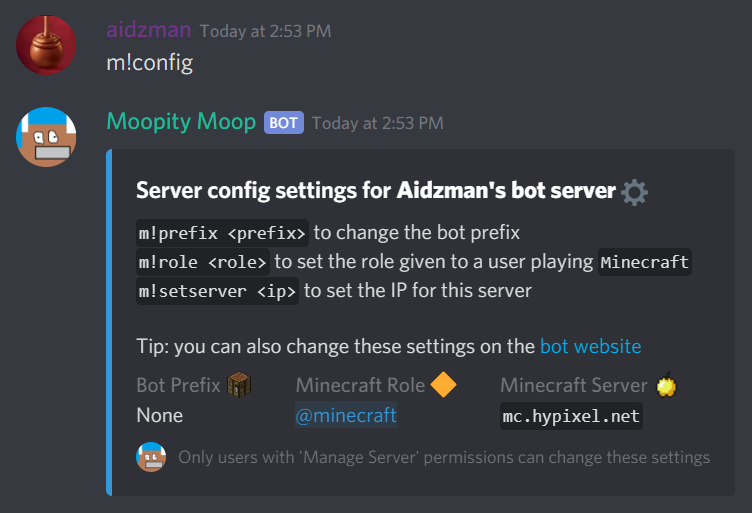
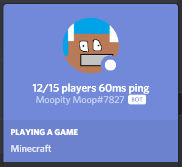
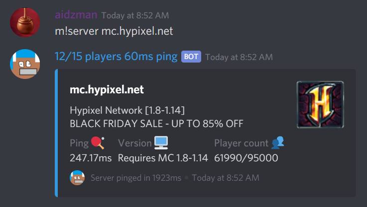
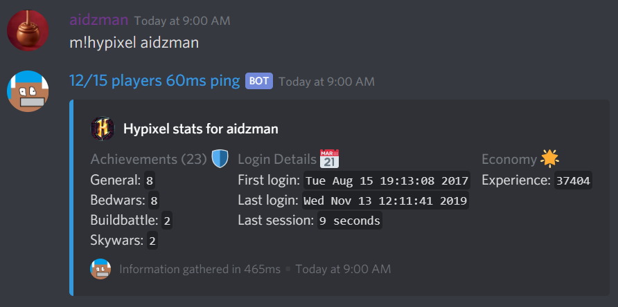
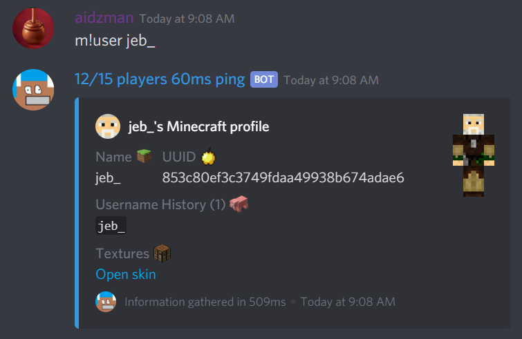

Moopity Moop
============

Moopity Moop is a feature rich bot with commands for Minecraft such as:
 - Minging Minecraft servers in real-time to find player counts, latency, etc
 - Auto-assigned Minecraft roles, for when a user starts playing Minecraft
 - Find stats on popular servers such as Hypixel, or the Hive!
 - Server MOTD checks and more!
 
Features
--------

*A customisable prefix, a role automatically given to users when they start playing Minecraft, and a server IP for automatic pinging, which the bot then sets its nickname to*

*The bot sets its nickname to the result of the last ping test, or `OFFLINE` if the server is offline*

*Retrieve stats about a Minecraft server in real time, providing MOTD, latency, and a player count*

*Find player data on popular servers such as Hypixel, or the Hive*

*Get a players `UUID`, username history, skin, or skin texture*

What are you waiting for? *[Invite now!](https://moopity-moop.chocolatejade42.repl.co/invite)*

